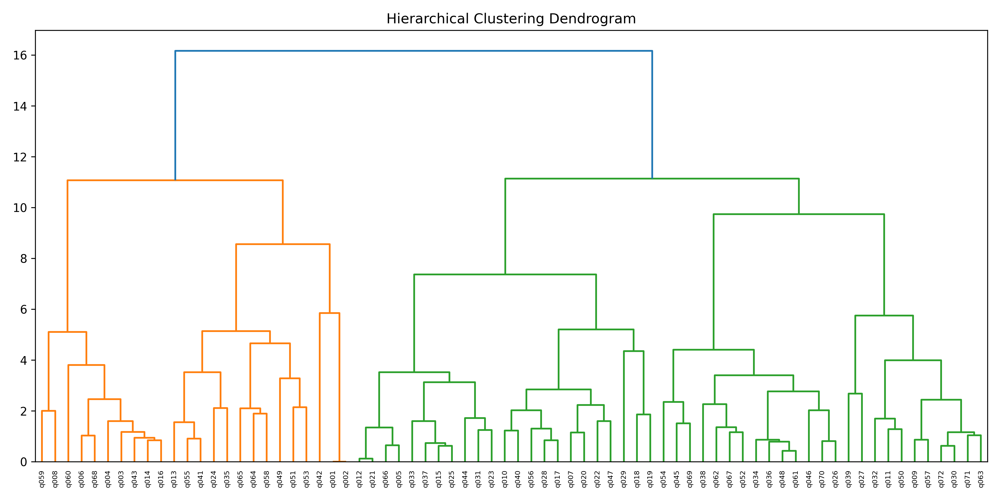
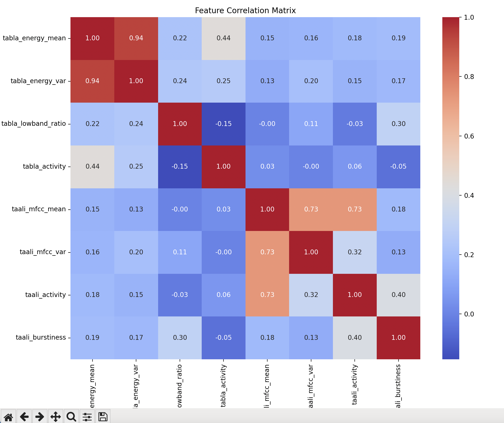
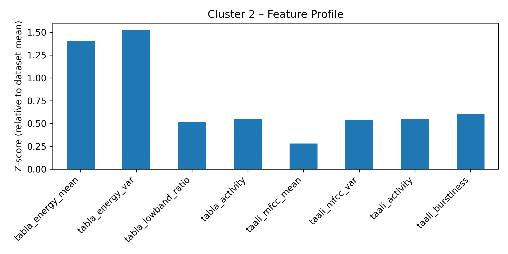
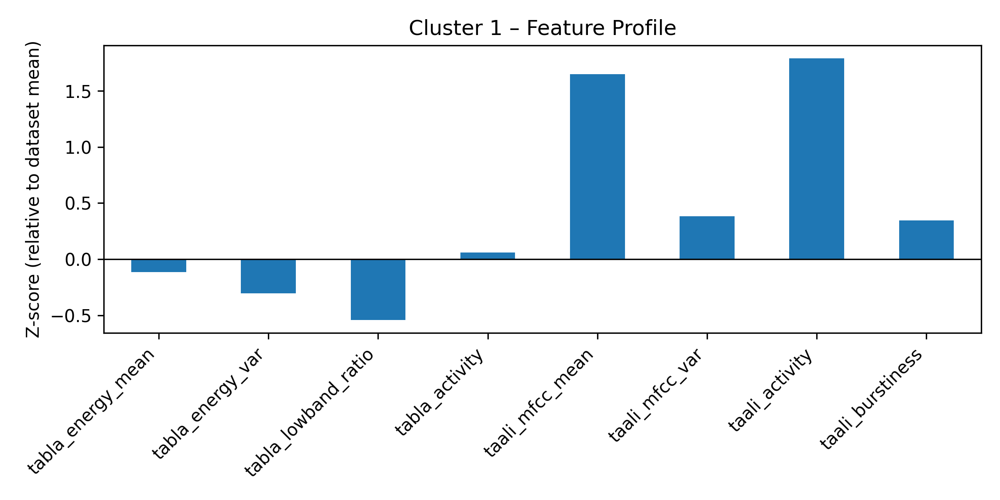
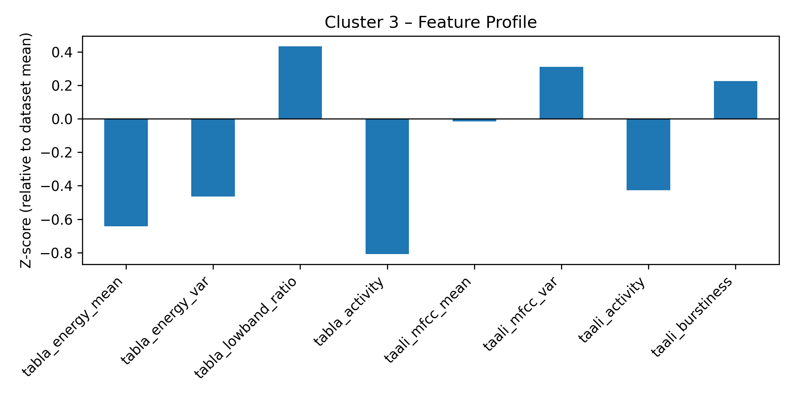
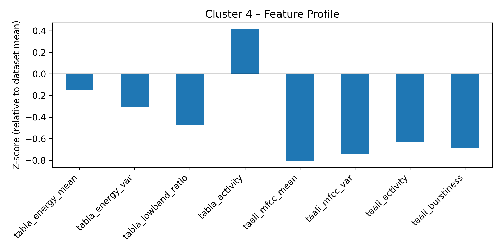
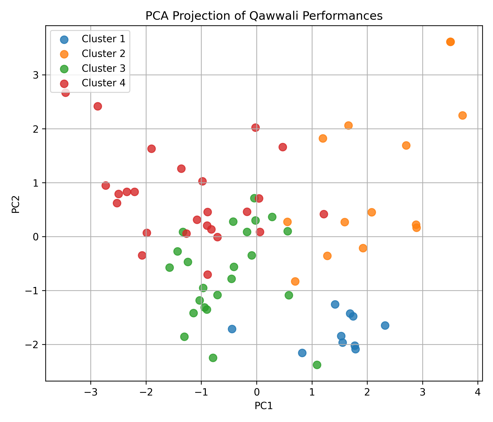

# Mehfilytics -- Performance-Based Acoustic Analysis of Qawwali Music

🌙 Mehfilytics investigates whether distinct performance based acoustic regimes^ emerge within Qawwali music, using audio-only, unsupervised analysis and a Big Data Analytics style pipeline.


This project deliberately studies how Qawwali is performed (focus on rhythm, percussion, vocal activity, and intensity) not lyrics, devotion, or religious semantics (yet!). All interpretations are grounded strictly in acoustic evidence.


This version of the project is an outline of something cooler -- for now, it is primarily for BDA Lab, but a longer term goal of this project can be a whole lot prettier.


## Objective
To investigate whether recurring patterns of musical performance can be discovered in Qawwali — a tradition characterized by long, improvisational, and collectively driven performances — using only audio-based, unsupervised analysis of rhythm, percussion, and vocal activity, and to study these patterns at scale within a Spark-based pipeline.


**Key constraints**:
- Audio only (no lyrics or semantic metadata)
- Unsupervised (no labels, no classifiers)
- Interpretive but non-declarative (descriptive regimes, not genre tags)

## Data Overview
### Audio
- Curated subset of the QawwalRang dataset
- 34 validated audio clips
- ~60 seconds each
- Mono, 44.1 kHz
- Dataset intentionally frozen post-validation for signal correctness


The dataset size is appropriate for exploratory MIR^ clustering and aligns with common practice for mid-level acoustic studies emphasizing interpretability over scale.

### Metadata
- Song ID
- Artist
- Source information
- Duration


Metadata is not used for clustering, only for optional post-hoc analysis.

## Feature Representation
Each audio clip is reduced to a **single interpretable feature vector** capturing:
- Tabla energy and rhythmic activity
- Taali / vocal transient density
- Spectral and temporal variation characteristics (the other acoustic features computed in `src/4_reduce_features.py`)


Final feature table:
```
34 songs × 8 acoustic features
```
## Outputs
This project produces analytic artifacts, not predictive models.
### 1. Cluster Assignments
Each performance is assigned a cluster via unsupervised hierarchical clustering.


Primary outputs:
- `data/qawwali_features_clustered.csv`
- `data/qawwali_features_clustered.parquet`

Structure:
`song_id × acoustic_features × cluster_id`

### 2. Cluster Profiles & Visualizations
For each cluster:
- Feature centroids
- Relative feature importance
- Per-cluster profile plots
- PCA visualization (interpretive only)


These artifacts support numerically justified interpretation of performance regimes.

### 3. Interpretive Findings
Clusters correspond to performance regimes, such as:
- Percussion dominant, rhythmically dynamic passages
- Taali / call–response-heavy sections
- Restrained or low activity passages
- Steady state rhythmic grounding sections


⚠️ Important: These are descriptive acoustic regimes, not semantic or genre labels. No claims are made such as “Cluster X = hamd / naat / ghazal.”

### 4. Big Data Analytics Validation
The structured feature outputs are:
- Ingested into Apache Spark (local mode)
- Queried using SparkSQL / Hive-style analytics
- Stored in columnar Parquet format


This demonstrates that the pipeline is:
- Scalable
- Framework compatible
- Deployable to HDFS without code changes

## System Architecture
```
Raw Audio (QawwalRang)
        ↓
Signal-Level Feature Extraction (Python / librosa)
        ↓
Structured Feature Table (CSV / Parquet)
        ↓
Spark (local or cluster mode)
        ↓
SparkSQL / Hive-style Analytics
        ↓
Analytic Results + Visualizations + Interpretation
```

## Design Rationale (BDA)
Low-level signal^ processing is intentionally performed outside Spark/Hadoop, in line with best practices in Music Information Retrieval.

Spark is used for:
- Structured aggregation
- Cluster validation
- SQL-style analytics
- Scalable querying and storage


The focus is methodological scalability, not dataset size.

## Project Status
- Dataset reconstruction & validation ✔
- Feature extraction & reduction ✔
- Unsupervised clustering ✔
- Interpretive profiling & PCA ✔
- Spark / Parquet analytics ✔

## Results & Analysis

### Hierarchical Structure Discovery
Hierarchical clustering on normalized acoustic features reveals a clear multi-level structure with a stable cut at 4 clusters (ref: `qawwali_features_clustered.csv:1-35`). The clustering produces balanced cluster sizes (6, 6, 10, 12 songs) with no singleton clusters or forced symmetry (ref `spark_results.txt:64-74`). Distances reflect genuine acoustic divergence rather than noise, as evidenced by the distinct feature profiles that emerge.


*Figure 1: Hierarchical clustering dendrogram showing natural separation of Qawwali performance regimes.*


### Feature Independence & Validity
Feature correlation analysis confirms that tabla energy statistics are strongly correlated internally (expected), while taali MFCC^ statistics form a separate correlated block (ref `4_reduce_features.py:25-35`). The 8 extracted features capture partially independent performance dimensions: tabla energy, variance, lowband ratio, and activity; plus taali MFCC statistics, activity, and burstiness (ref `qawwali_features.csv:1-8`). This validates the design choice of separating percussion-driven and vocal/taali-driven features.

The correlation matrix visualization shows: 
- Strong intra-group correlations within core tabla energy features and taali MFCC features
- Weak to moderate cross-group correlations 
- This validates the design choice of separating percussion-driven and vocal/taali-driven features


*Figure 2: Correlation matrix visualisation for 8 core features.*

### Cluster Profiling (Interpretive, Audio-Only)
Each cluster exhibits a distinct acoustic signature based on z-score normalized features (ref `6_cluster_profiling.py:41-54`):

- Cluster 2: High tabla energy & variance (z-scores up to +2.85) → percussion-dominant performances
- Cluster 1: Elevated taali activity (z-scores up to +1.95) → call-response/vocal emphasis
- Cluster 3: Low energy & activity (most songs with taali_activity = 0.0) → restrained or transitional passages
- Cluster 4: Moderate energy with suppressed taali → steady-state rhythmic grounding


All interpretations remain audio-only, feature-backed, and descriptive without semantic labels.





*Figures 3a, b, c, d: Four distinct clusters formed visualized through z-score normalized features*


### PCA Visualization
2D PCA projection explains 60.2% of total variance (33.3% + 26.9%) (ref `7_pca_visualization.py:78-86`). Clusters show partial overlap, which is expected in real acoustic data, while separation trends remain consistent with hierarchical clustering results. PCA is used strictly for interpretability, not decision-making.


*Figure 4a: PCA Clusters Projection*


*Figure 4b: Labeled PCA Clusters Mapped to Songs*

### Spark / Big Data Analytics Validation
The clustered feature table was successfully ingested into Spark with automatic schema inference (8 double features + 1 integer cluster) (ref `spark_results.txt:39-50`). Distributed aggregations and SparkSQL queries executed successfully, including per-cluster feature means and performance counts (ref `spark_results.txt:76-108`). Data was persisted to Parquet format and reloaded with integrity intact (ref `spark_results.txt:110-123`) , confirming BDA-readiness and compatibility with scalable data pipelines.

Execution transcript: `spark_results.txt`

### Notes
- All cluster interpretations are derived from normalized z-scores relative to the dataset mean
- The feature reduction from time-frequency matrices to 8 scalar features enables efficient Spark processing
- No semantic or genre labels are assigned - clusters represent acoustic performance regimes only
- The entire pipeline validates that distinct performance-based acoustic regimes emerge in Qawwali music using unsupervised, audio-only analysis


All implementation details, commands, and verification steps are documented in `implementation_guide.md`.

## Glossary 
* **CQT**: Constant-Q Transform is a time–frequency representation for music that maps audio into logarithmically spaced frequency bins aligned with musical notes. Unlike Fourier transforms with fixed resolution, CQT gives better pitch detail for low notes and better time detail for high notes, matching how humans hear music. For example, a low bass note and its harmonics stay clearly separated, while fast high-pitched claps or strokes remain sharp in time. The constant quality factor (Q) keeps harmonic patterns consistent across pitches, making CQT useful for instrument recognition, music transcription, and timbre analysis.
* **Low signal level**: basic features extracted from an audio signal, which are currently the main focus of Music Information Retrieval techniques due to the limitations in capturing more complex aspects of music content.
* **MFCC**: Mel-frequency cepstral coefficients are audio features that summarize the sound spectrum in a compact way, designed to match how humans perceive sound. Sound/raw audio is like a string of pressure values, comparable to an HD photo, and MFCC extracts the outline. Mel-freq relates to how humans hear sound (200hz and 400hz diff seems bigger than 5200hz and 5400 hz), and bends frequencies to match this perception. Cepstral analysis separates the overall shape of the sound (timbre) from fine details.
* **MIR**: Music Information Retrieval refers to the extraction of information from music and its analysis.
* Performance Regime: A recurring way the music is being performed, based on how it sounds — not what it means. i.e. a stable acoustic pattern that keeps reappearing across Qawwali performances.
* **Taali**: rhythmic clapping that denotes beats or sections within a time cycle (Taal). Qawwali (and other music forms) can be based on different taal cycles, most commonly teen-taal, which has 16 beats, segmented into 4 vibhags of 4 beats each.
* **Tabla**: percussion drum component. Played to match taal cycles and support taali and vocals. 
* **Features Extracted**:
  * `tabla_energy_mean`: Overall percussion intensity across the entire performance.
  * `tabla_energy_var`: Dynamic range and variation in tabla intensity.
  * `tabla_lowband_ratio`: Bass emphasis ratio using lowest 20 CQT bins.
  * `tabla_activity`: Proportion of time frames with active tabla signal.
  * `taali_mfcc_mean`: Average timbral characteristic of vocal/clapping component.
  * `taali_mfcc_var`: Timbral diversity in the taali component.
  * `taali_activity`: Proportion of time frames with active vocal/clapping signal.
  * `taali_burstiness`: Suddenness measure of clapping/transient events.
